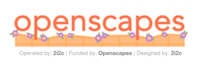
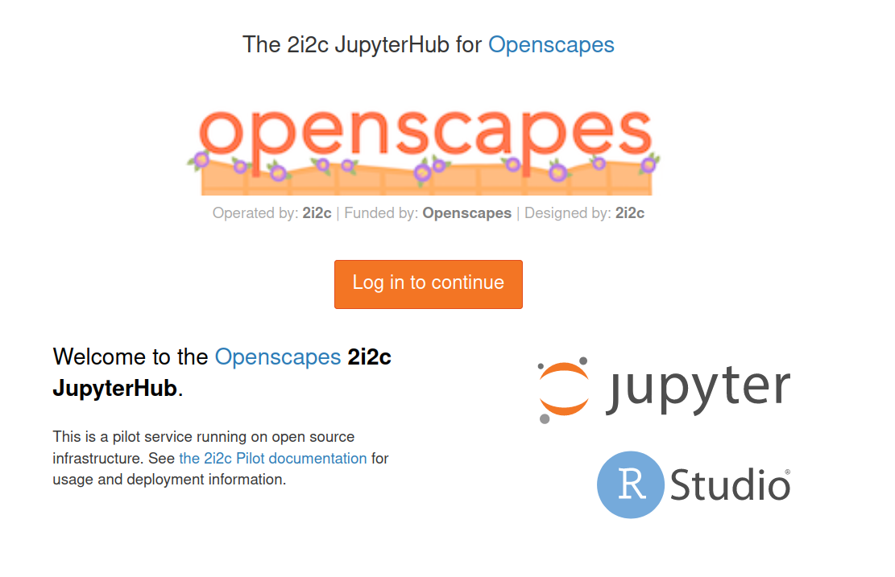
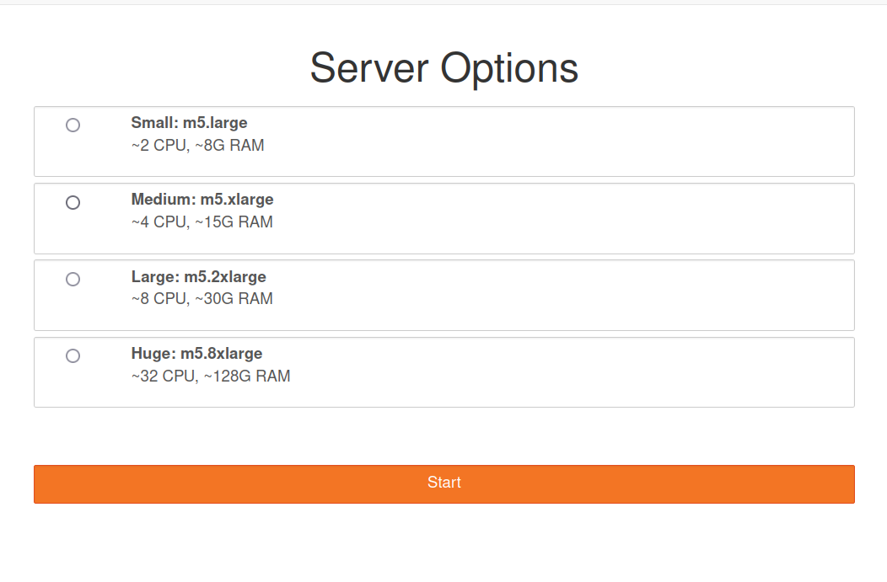
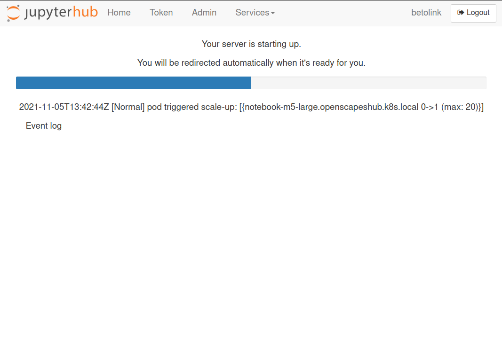

**Summary of what we'll cover:**

 * What's a cloud environment and why we are using it.
 * Learn about the Jupyter ecosystem and our cloud infrastructure.
 * Start/Stop our Openscapes server and get familiar with Jupyterlab and installed programs
 * How to update our environments
 * NASA Earthdata Login and security in the cloud.

> **Note**: Some sections of this document have been taken from previous hackweeks organized by the University of Washington eScience Institute.


## Why are we using a cloud environment?

"Anyone working with large-scale Earth System data today faces the same general problems:

 * The data we want to work with are huge (typical analyses involve several TB at least)
 * The data we need are produced and distributed by many different organizations (NASA, NOAA, ESGF, Copernicus, etc.)
 * We want to apply a wide range of different analysis methodologies to the data, from simple statistics to signal processing to machine learning.

The community is waking up to the idea that we can’t simply expect scientists to download all this data to their personal computers for processing."

*Ryan Abernathey, Pangeo Project.*


## Openscapes Hub and Cloud Infrastructure

*There is no cloud, it's someone else's computer*

Go to Openscapes Jupyter Hub. You will be asked to log in with your GitHub Account



Once we are logged with our Github account we need to select our server type. 
There are different hardware configurations for each profile, for the duration of the Hackweek we'll use small instances, the option at the top.



After we select our server type and click on start, Jupyterhub will allocate our instance using Amazon Web Services (AWS). This may take several minutes. While we wait, we'll get set up with GitHub and a brief overview.




## Jupyter Ecosystem


Source: Project Pythia

## Python/Conda environments

```yaml
name: nsidc
channels:
  - conda-forge
dependencies:
  - ipykernel
  - awscli~=1.21.4
  - requests
  - pip
```

### How do I get my code in and out of the Openscapes hub?

When you start your own server you will have access to your own virtual drive space. No other users will be able to see or access your data files. You can easily upload files to your virtual drive space and save files from the hub back to another location, such as GitHub or your own local laptop drive.

Here we'll show you how to pull (copy) some files from GitHub into your virtual drive space using git. This will be a common task during the hackweek: at the start of each tutorial we'll ask you to "fork" (create your own copy of in your GitHub account) and "clone" (make a copy of in a computing environment, such as your local computer or Openscapes instance) the GitHub repository corresponding to the specific tutorial being taught into your Openscapes drive space.


This will open a new terminal tab in your JupyterLab interface:


Now you can issue any Linux commands to manage your local file system.

You may also upload files from your local system using the upload button (up-pointing arrow) on the top left of the JupyterHub navigation panel. Similarly, you may download files to your local system by right-clicking the file and selecting download (down-pointing arrow).

Simple, example GitHub/git/local-workspace workflows for getting a tutorial started in your Openscapes instance and working on a group project are provided. The [getting started on a tutorial](https://icesat-2hackweek.github.io/learning-resources/tutorials/getting_started) workflow briefly reviews much of the information in this preliminary exercise along with steps for making and saving notes or other changes as you work through the tutorial and keeping it updated with the original, master copy. The [basic git workflow for a project](https://icesat-2hackweek.github.io/learning-resources/projects/example_workflow) serves as a reminder of the git workflow for working on a group project while minimizing code conflicts that could result from multiple people making changes to the same files simultaneously.
<br>

## How do I end my Openscapes session? 

When you are finished working for the day it is important to explicitly log out of your Openscapes session. The reason for this is it will save money and is a good habit to be in. When you keep a session active it uses up AWS resources and keeps a series of virtual machines deployed.

Stopping the server happens automatically when you log out, so navigate to "File -> Log Out" and click "Log Out"!


### Will I lose all of my work?

Logging out will **NOT** cause any of your work to be lost or deleted. It simply shuts down some resources. It would be equivalent to turning off your desktop computer at the end of the day.

## References

 * [Project Pythia](https://foundations.projectpythia.org)
 * [Why Jupyter is data scientists’ computational notebook of choice](https://www.nature.com/articles/d41586-018-07196-1)
 * [Closed Platforms vs. Open Architectures for Cloud-Native Earth System Analytics](https://medium.com/pangeo/closed-platforms-vs-open-architectures-for-cloud-native-earth-system-analytics-1ad88708ebb6)
 * [Introduction to Geospatial Concepts](https://datacarpentry.org/organization-geospatial/)
 * [2i2c user storage](https://infrastructure.2i2c.org/en/latest/topic/storage-layer.html)
 * [SnowEX Hackweek](https://snowex-hackweek.github.io/website/intro.html)

## FAQ

*from participants during our first Clinic*

**I have an empty ‘`shared`’ folder**. That's expected. There shouldn't be anything in the ‘`shared/`’  folder

**After the 3 months are up, what do we do with our work on the server?** You’ll have them since you can back everything up with GitHub. We can follow up with more details of what happens on the 2i2c side

**Can we use Matlab with JupyterHub?** You can also use [Octave kernel](https://datascience-enthusiast.com/Miscellaneous/Jupyter_R_Python_Julia_Octave.html) as a Matlab replacement. It is open source and free. If you want to integrate Matlab, there is a project to do so [jupyter-matlab-proxy](https://github.com/mathworks/jupyter-matlab-proxy)


**Why do we have the same home directory as /home/jovyan?** /home/jovyan is the default home directory for 'jupyter' based images/dockers. It is the historic home directory for Jupyter deployments. 

**/home/jovyan is the default home directory for *jupyter*-based deployments**

**Can other users see the .git-credentials file in my /home/jovyan folder?** No, other users can not see your creds

**How to exit 2i2c's terminal text editor?** `esc` to get to the command, and then `:w` to save, `:q` to quit. 
