## Summary

In this session, we will provide a brief introduction to:

1.  Command line (**terminal**/shell)
2.  Version Control (code management using **git**)
3.  Programming in **Python** (using Jupyter Notebook)
4.  Geospatial Fundamentals (optional, self-study)

You will need a working knowledge of git and terminal for this hackathon. We will provide an overview of these topics and also share resources for self-paced learning.

## Introduction :: Command Line (Terminal/Shell)

### Shell Basics

1.  [What is Terminal or Shell?](https://swcarpentry.github.io/shell-novice/01-intro/index.html)
2.  [Navigating Files and Directories](https://swcarpentry.github.io/shell-novice/02-filedir/index.html)
3.  [Working with Files and Directories](https://swcarpentry.github.io/shell-novice/03-create/index.html)

### Shell: More Details

Detailed self-paced lesson on shell: [Shell Lesson from Software Carpentry](http://swcarpentry.github.io/shell-novice/)

## Introduction :: Version Control (Git and Github)


### What is version control, git, github, and how to set it up?

Version control is managing and tracking changes to your documents (program source code, images, websites, data files, etc.). `git` is a popular tool used for version control of software code. [github.com](https://github.com/) is popular platform that provides remote server hosting for git repositories. A repository is a collection of various files that you are tracking for changes and versions (think of it as a directory with files that are being tracked for changes, using `git` for taking snapshots of versions as you are developing).


This section is a step-by-step guide to set up `git` on your [2i2c JupyterHub instance](openscapes.2i2c.cloud) (referred to as `2i2c JupyterHub` in these instruction). We will also configure `git` to use your [github.com](https://github.com/) account for managing your repositories hosted on [github.com](https://github.com/). There are 5 main steps with substeps, includes instruction for addressing github's new approach for [token authentication](https://github.blog/changelog/2021-08-12-git-password-authentication-is-shutting-down/).

### Step 1: Create a github account

To complete the setup, you will need an account on [github.com](https://github.com/). If you don't have an account, please visit [github.com](https://github.com/), create an account (free) and come back to this guide for setting up git.

### Step 2: Fork a repository

A **fork** is a copy of a repository from another github account (for example **NASA-Openscapes** account) to your github account (for example, my account **virdi**) that then you have permission to edit. To help you finish this setup correctly, we have created a demo repository on Openscapes github account named **check_github_setup**. You can **fork** this repository into your github account following these steps:

1.  Log in to your [github.com](https://github.com/) account

2.  Go to the demo repository at [NASA-Openscapes github](https://github.com/NASA-Openscapes/check_github_setup)

    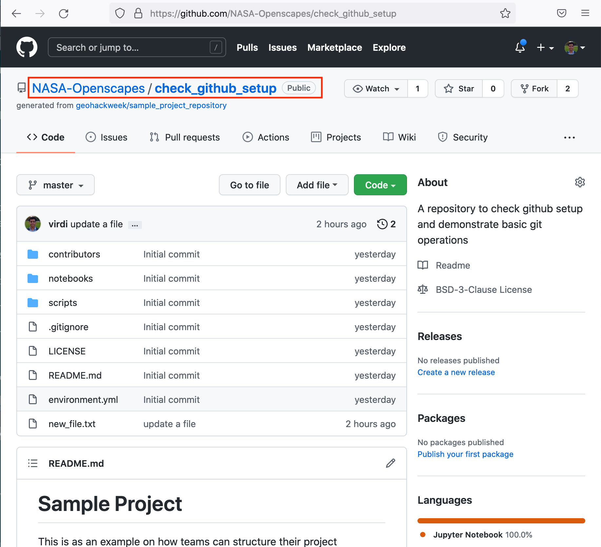{width="520"}

3.  Click on the fork icon in the top right corner, as shown in the image below and click your user name if prompted to do so

    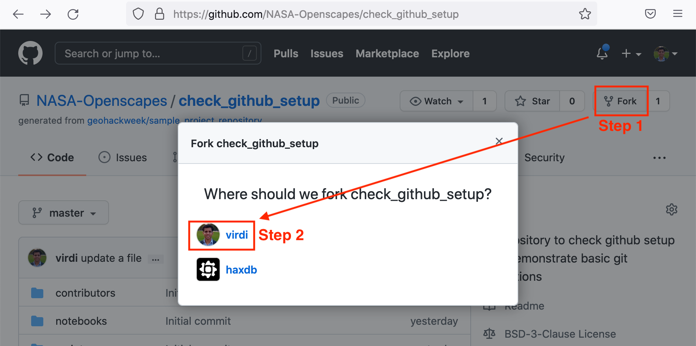{width="520"}

### Step 3: Clone the repository that you just forked

Now you have a fork of the demo repository in your github account that we can `clone` it in your 2i2c instance. In the code below, commands beginning with `git` is a git command for version control and synching; commands that don't start with `git` are bash/linux/command line commands.

1.  Start your 2i2c JupyterHub and open a terminal

    `File >> New >> Terminal`

2.  Make sure you are in your **home directory** by using`pwd` command and verifying the output as below

    `/home/jovyan`

    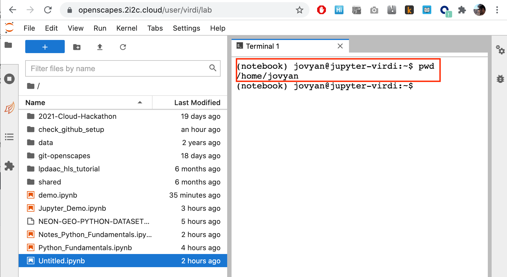{width="520"}

3.  Configure git with your name and email address.

    ``` bash
    git config --global user.name "Makhan Virdi"
    git config --global user.email "Makhan.Virdi@gmail.com"
    ```

    **Note:** This name and email could be different from your github.com credentials. Remember `git` is a program that keeps track of your changes locally (on 2i2c JupyterHub or your own computer) and github.com is a platform to host your repositories. However, since your changes are tracked by `git`, the email/name used in git configuration will show up next to your contributions on github.com when you `push` your repository to github.com (`git push` is discussed in a later step).

4.  Configure `git` to store your github credentials to avoid having to enter your github username and token each time you push changes to your repository(in [Step 5](#step-5.-create-access-token-on-github.com), we will describe how to use github token instead of a password)

    ``` bash
    git config --global credential.helper store
    ```

5.  Copy link for the demo repository from your github account. Click the green "Code" button and copy the link as shown.

    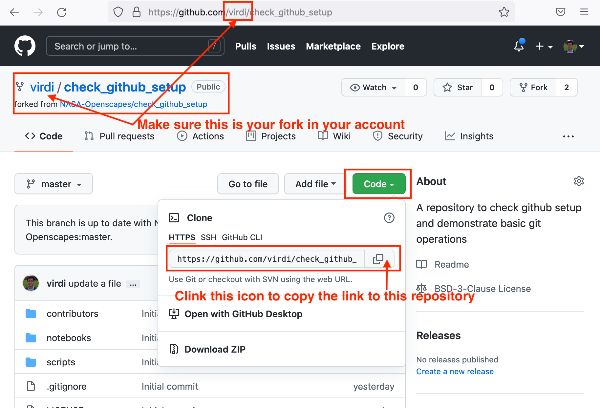

6.  Clone the repository using `git clone` command in the terminal

    To clone a repository from github, copy the link for the repository (previous step) and use `git clone`:

    ```bash
    git clone https://github.com/YOUR-GITHUB-USERNAME/check_github_setup
    ```

    **Note:** Replace `YOUR-GITHUB-USERNAME` here with your github.com username. For example, it is `virdi` for my github.com account as seen in this image.

    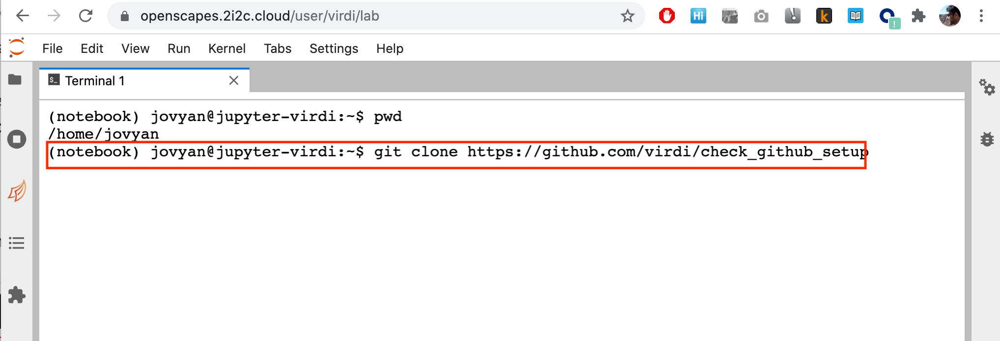{width="520"}

    Use `ls` (list files) to verify the existence of the repository that you just cloned

    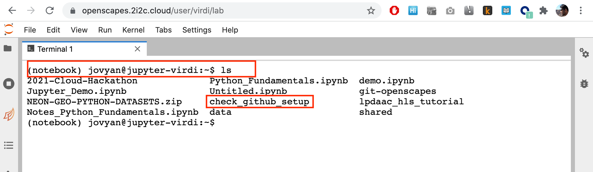{width="520"}

7.  Change directory to the cloned repository using `cd check_github_setup` and check the current directory using `pwd` command (present working directory)

    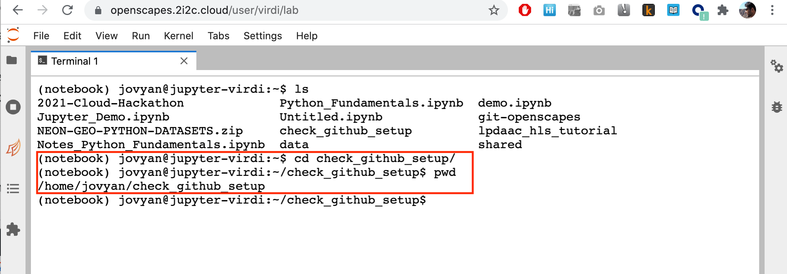{width="520"}

8.  Check status of your git repository to confirm git set up using `git status`

    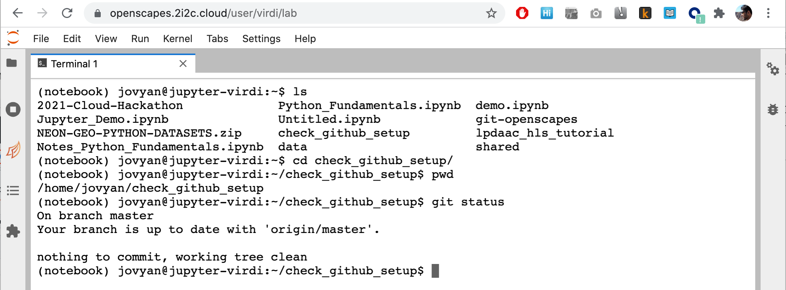

    You are all set with using git on your 2i2c JupyterHub! But the collaborative power of git through github needs some additional setup.

    In the next step, we will create a new file in this repository, track changes to this file, and link it with your github.com account.

### Step 4. Creating new file and tracking changes

1.  In the left panel on your 2i2c JupyterHub, click on the "directory" icon and then double click on "check_github_setup" directory.

    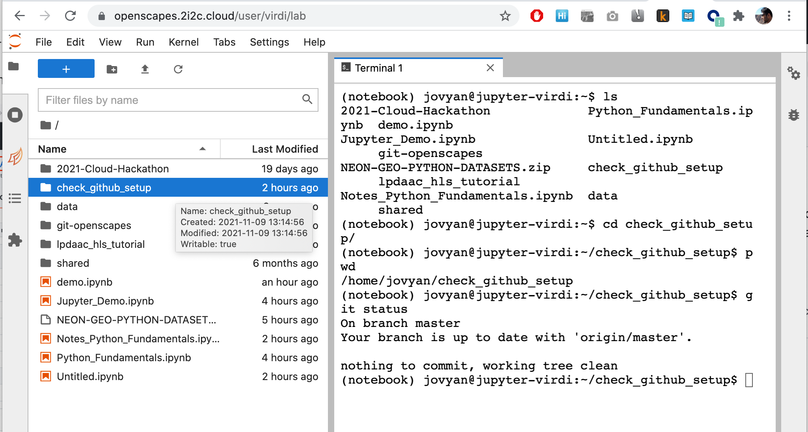

    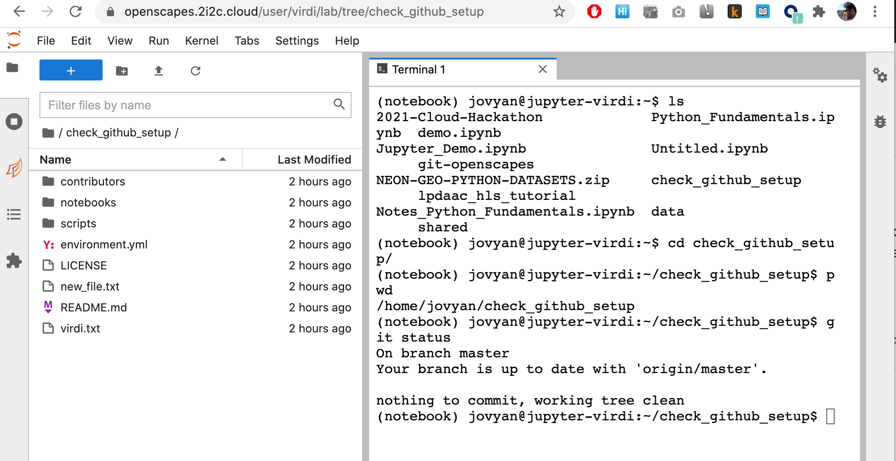

2.  Once you are in the **check_github_setup** directory, create a new file using the text editor in your 2i2c JupyterHub (`File >> New >> Text File`).

    

    Name the file lastname.txt. For example, **virdi.txt** for me (use your last name). Add some content to this file (for example, I added this to my **virdi.txt** file: `my last name is virdi`).

    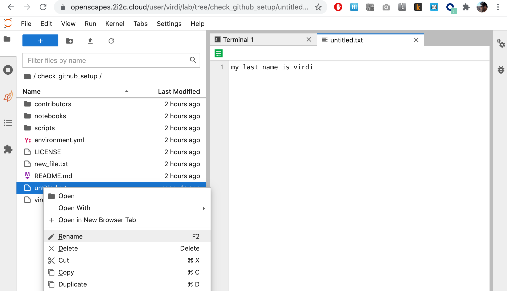

3.  Now you should have a new file (lastname.txt) in the git repository directory **check_github_setup**

4.  Check if `git` can see that you have added a new file using `git status`. Git reports that you have a new file that is not tracked by git yet, and suggests adding that file to the git tracking system.

    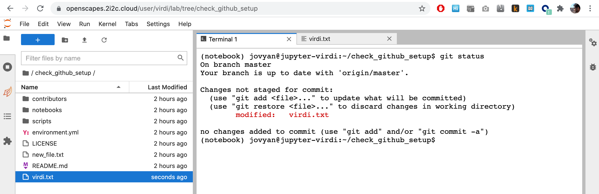

5.  As seen in this image, `git` suggests adding that file so it can be tracked for changes. You can add file to `git` for tracking changes using `git add`. Then, you can commit changes to this file's content using `git commit` as shown in the image.

    ``` bash
    git add virdi.txt
    git status
    git commit -m "adding a new file"
    git status
    ```

    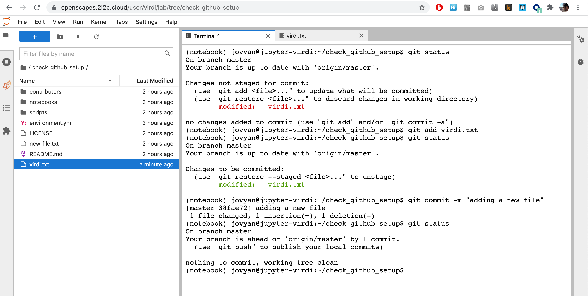

6.  As seen in the image above, `git` is suggesting to push the change that you just committed to the remote server at github.com (so that your collaborators can also see what changes you made).

    **Note: DO NOT** execute `push` yet. Before we push to github.com, let's configure `git` further and store our github.com credentials to avoid entering the credentials every time we invoke `git push`. For doing so, we need to create a **token** on github.com to be used in place of your github.com password.

### Step 5. Create access token on github.com {#step-5.-create-access-token-on-github.com}

1.  Go to your github account and create a new "personal access token": <https://github.com/settings/tokens/new>

    [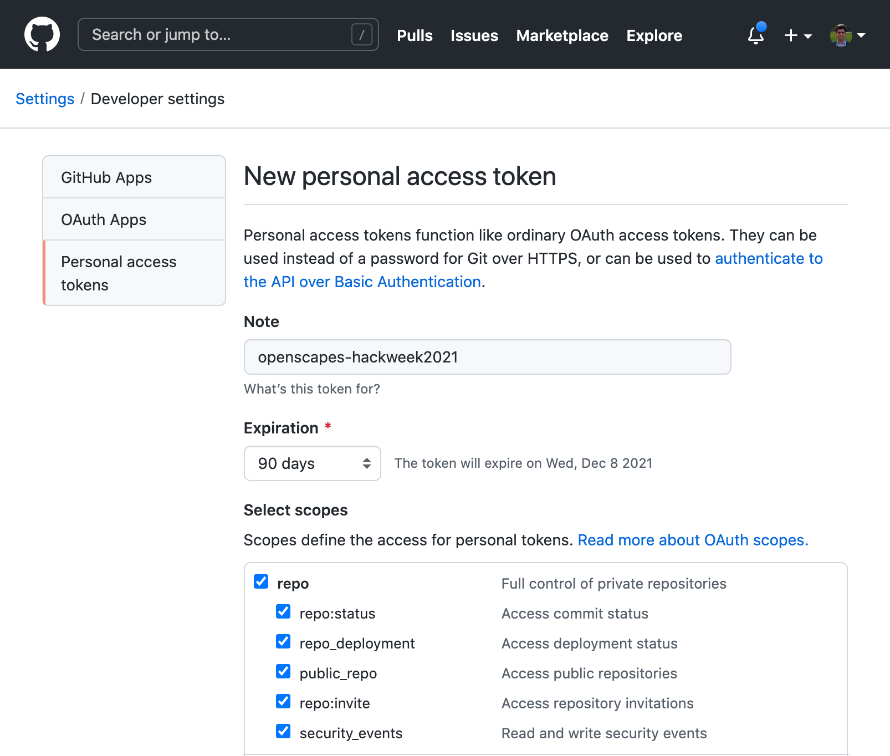](https://github.com/settings/tokens/new)

2.  Enter a description in "Note" field as seen above, select "repo" checkbox, and scroll to the bottom and click the green button "Generate Token". Once generated, copy the token (or save it in a text file for reference).

    **IMPORTANT:** You will see this token only once, so be sure to copy this. If you do not copy your token at this stage, you will need to generate a new token.

    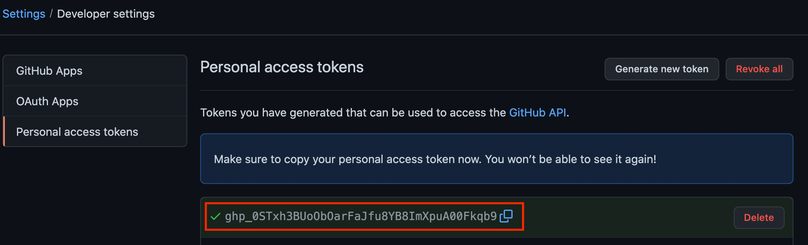

3.  To push (transfer) your changes to github, use `git push` in terminal. It requires you to enter your github credentials. You will be prompted to enter your github username and "password". **When prompted for your "password", DO NOT use your github password, use the github token** that was copied in the previous step. 

    ``` bash
    git push
    ```

    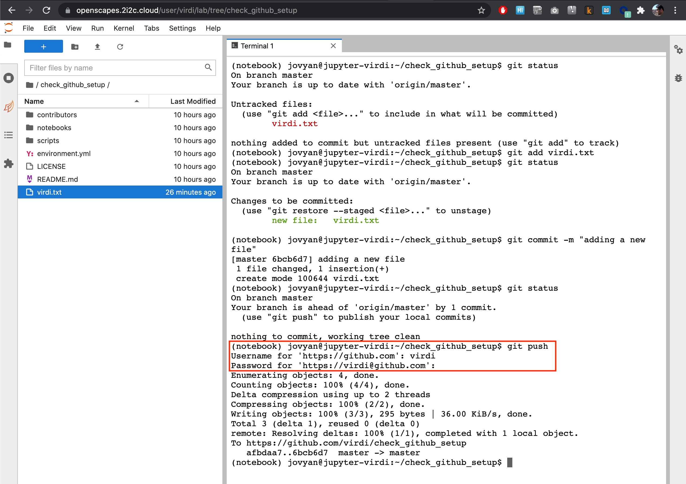

    **Note:** When you paste your token in the terminal window, windows users will press Ctrl+V and mac os users will press Cmd+V. If it does not work, try generating another token and use the copy icon next to the token to copy the token. Then, paste using your computer's keyboard shortcut for paste.

4.  Now your password is stored in `~/.git-credentials` and you will not be prompted again unless the Github token expires. You can check the presence of this git-credentials file using Terminal. Here the `~` character represents your home directory (`/home/jovyan/`).

    ``` bash
    ls -la ~
    ```

    The output looks like this:

    ``` bash
    drwxr-xr-x 13 jovyan jovyan 6144 Oct 22 17:35 .
    drwxr-xr-x  1 root   root   4096 Oct  4 16:21 ..
    -rw-------  1 jovyan jovyan 1754 Oct 29 18:30 .bash_history
    drwxr-xr-x  4 jovyan jovyan 6144 Oct 29 16:38 .config
    -rw-------  1 jovyan jovyan   66 Oct 22 17:35 .git-credentials
    -rw-r--r--  1 jovyan jovyan   84 Oct 22 17:14 .gitconfig
    drwxr-xr-x 10 jovyan jovyan 6144 Oct 21 16:19 2021-Cloud-Hackathon
    ```

    You can also verify your git configuration

    ``` bash
    (notebook) jovyan@jupyter-virdi:~$ git config -l
    ```

    The output should have `credential.helper = store`:

    ``` bash
    user.email        = Makhan.Virdi@gmail.com
    user.name         = Makhan Virdi
    credential.helper = store
    ```

Now we are all set to collaborate with github on the JupyterHub during the Cloud Hackathon!

### Summary: Git Commands

| Git Command  | Description                                                                                                                     |
|--------------|---------------------------------------------------------------------------------------------------------------------------------|
| `git status` | Shows the current state of the repository: the current working branch, files in the staging area, *etc.*                        |
| `git add`    | Adds a new, previously untracked file to version control and marks already tracked files to be committed with the next `commit` |
| `git commit` | Saves the current state of the repository and creates an entry in the log                                                       |
| `git log`    | Shows the history for the repository                                                                                            |
| `git diff`   | Shows content differences between commits, branches, individual files and more                                                  |
| `git clone`  | Copies a repository to your local environment, including all the history                                                        |
| `git pull`   | Gets the latest changes of a previously cloned repository                                                                       |
| `git push`   | Pushes your local changes to the remote repository, sharing them with others                                                    |

: Commonly used git commands (modified from [source](https://uwhackweek.github.io/jupyterbook-template/tutorials/jupyter.html))

### Git: More Details

**Lesson**: For a more detailed self-paced lesson on git, visit [Git Lesson from Software Carpentry](http://swcarpentry.github.io/git-novice/)

**Cheatsheet**: [Frequently used git commands](https://training.github.com/downloads/github-git-cheat-sheet.pdf)

**Dangit, Git!?!**: If you are stuck after a git mishap, there are ready-made solutions to common problems at [Dangit, Git!?!](https://dangitgit.com/en)


### Cloning our repository using the [**git Jupyter lab extension**](https://github.com/jupyterlab/jupyterlab-git).

If we're already familiar with git commands and feel more confortable using a GUI our Jupyterhub deployment comes with a git extension. This plugin allows us to operate with git using a simple user interface.

For example we can clone our repository using the extension.

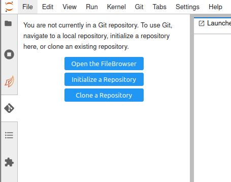


## Introduction :: Programming in Python

Switch to Jupyter Notebook for an introduction to programming in Python

-   Variables (and mathematical operations)
-   [Data Structures](https://swcarpentry.github.io/python-novice-inflammation/04-lists/index.html) (list, tuple, dict)
-   [Flow Control](https://swcarpentry.github.io/python-novice-inflammation/05-loop/index.html) using loops (for, while)
-   [Conditionals](https://swcarpentry.github.io/python-novice-inflammation/07-cond/index.html) (if, else, elif)
-   [Functions](https://swcarpentry.github.io/python-novice-inflammation/08-func/index.html)
-   [Errors and Exceptions](https://swcarpentry.github.io/python-novice-inflammation/09-errors/index.html) (understanding and handling errors)
-   Using modules (libraries, packages)
    -   [pandas](https://pandas.pydata.org/docs/): high-performance, easy-to-use data structures and data analysis tools
    -   [rioxarray](https://corteva.github.io/rioxarray/stable/): based on the rasterio package for working with rasters and [`xarray`](http://xarray.pydata.org/en/stable/)

### Python Learning Resources

Self-paced lesson on [Programming with Python](https://swcarpentry.github.io/python-novice-inflammation/) from Software Carpentry

## Introduction :: Geospatial Fundamentals (Optional)

Detailed self-paced lesson on [Fundamentals of Geospatial Raster and Vector Data with Python](https://carpentries-incubator.github.io/geospatial-python/) from Data Carpentry

The end! 
