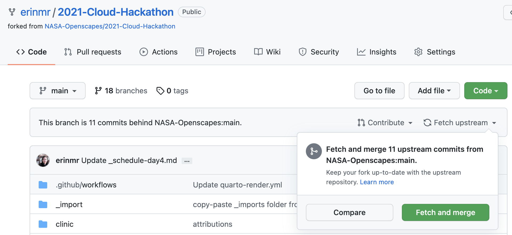
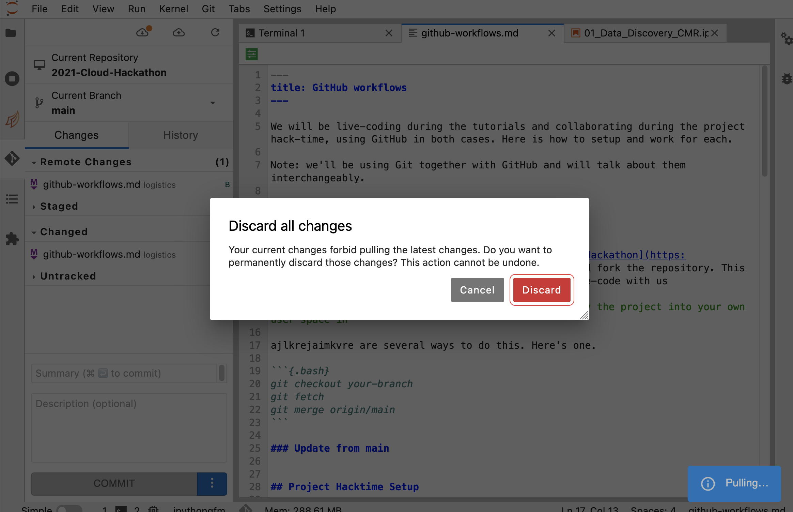

We will be live-coding during the tutorials and collaborating during the project hack-time, using GitHub in both cases. Here is how to setup and work for each. 

Note: we'll be using Git together with GitHub and will talk about them interchangeably. 

## First-Time Setup

### Fork the hackathon repo

Go to [https://github.com/nasa-openscapes/2021-Cloud-Hackathon](https://github.com/nasa-openscapes/2021-Cloud-Hackathon) and fork the repository. This will enable you to you can edit your own copy and live-code with us

> Note: The term fork means that you are going to copy the project into your own user space in Github


### Clone your forked repo into JupyterHub

Open your terminal

```{.bash}
git clone https://github.com/YOUR-USERNAME/2021-Cloud-Hackathon
```

*don't do all the credentials/token — they don't need push access to follow along with the tutorials. We can help them via Slack/breakouts when/if they need to push with tokens*

## Daily Setup

The daily setup has 2 steps: get the latest into your forked copy of the repo, then get the latest of your fork into your JupyterHub.

If you have any conflicts with the following steps, you will likely need to commit your work, or clear your work if you don't want to keep anything you've done. See below for [daily setup troubleshooting](#daily-setup-troubleshooting) as well as [Git update, revert, etc](#git-update-revert-etc).

### GitHub: Update your fork  

**From github.com Fetch and merge**: Update your forked repo from main by clicking "Fetch upstream" beneath the big green code button, and then the green "Fetch and merge" button. You may have to refresh the page to see any recent activity.



### JupyterHub: Get your fork's updates

Go to the JupyterHub 

Go to the GitHub extension and click the "pull button"

If you see 



You'll need to decide if you want to keep or delete the changes you made yesterday. This will depend on the work you did and how important it was. If you'd like to delete it, please follow [delete your local changes](#delete-your-local-changes) below, and then come back above and retype `git status` and `git pull`. 

If you'd like to keep your changes, you'll need to commit them. You can press "Cancel" and look at the files in the "Changed" category and you can hover over the file to inspect them (open, diff, discard, add) and if you'd like to add them, they will be staged and then you can commit them with a message.

You could also do the above in the terminal, making sure you are in the `2021-Cloud-Hackathon` directory (double check with `pwd` and move with `cd`)

```{.bash}
git status
git pull
```

### Daily setup troubleshooting

**Not a git repository** - in your terminal if you see the following, you likely need to `cd` change directory into your GitHub folder.

```{.bash}
fatal: not a git repository (or any parent up to mount point /home)
Stopping at filesystem boundary (GIT_DISCOVERY_ACROSS_FILESYSTEM not set).
```

## Git: update, revert, etc

These are some useful commands to revert/delete your local changes and update your fork with the most recent information from the main branch.

### Delete your local changes

There are several ways to delete your local changes if you were playing around and want to reset. Here are a few: 

#### Undo changes you've maybe saved or committed, but not pushed 

This is less time and internet intensive (no new clone/download). 

If you've got changes saved, but not yet staged, committed, or pushed, you'll delete unstaged changes in the working directory with clean:

You'll need to make sure you're in the github repository (use `pwd` to check your present working directory and `cd` to change directory)

```{.bash}
git clean -df
git checkout -- .
```


#### Burn it all down

You'll delete the whole repo that you have locally, and then reclone. 

You'll need to make sure you're in the github repository (use `pwd` to check your present working directory and `cd` to change directory)

```{.bash}
rm -rf YOUR-REPO
```

Here is a whole blog on how to go back in time (walk back changes), with conceptual diagrams, command line code, and screenshots from RStudio. <https://ohi-science.org/news/github-going-back-in-time>

### Update local branch with remote main branch

If while you're working you would like to update your local
`your-branch` with the most recent updates on the `main` branch on
GitHub.com, there are several ways to do this. Here's one.

```{.bash}
git checkout your-branch
git fetch
git merge origin/main
```

### Update from main


## Project Hacktime Setup

Here are some suggestions for collaborating with your project groups (and beyond!) using GitHub. 

This means a combination of creating a place to collaborate (a github repository) and a shared workflow to contribute. 

### Create a repository on GitHub.com

Just one person does this.

You can do this in one of your user/organization accounts, or ask someone from the Cloud Hackathon Team to create one for you in the NASA-Openscapes organization. 

Here are instructions for [creating a repo on GitHub.com](https://rstudio-conf-2020.github.io/r-for-excel/github.html#create-a-repository-on-github.com) — remember to make it public so that other hackathon folks can see and help!

### Discuss edit access vs branches

The person who created the repo will manage the permission. 

The simplest way to collaborate on GitHub is if everyone has permission to edit the repository directly through the main branch. Talk to your team — folks that have experience using branches can do so but others can push changes directly to the main branch. 

Here are instructions for [updating github repo permissions](https://docs.github.com/en/repositories/managing-your-repositorys-settings-and-features/managing-repository-settings/managing-teams-and-people-with-access-to-your-repository#inviting-a-team-or-person). 

### Clone repo into 2i2c

Everybody does this. 

To to the JupyterHub, go to your Terminal, then: 

`git clone https://github.com/USERNAME/REPOSITORY-NAME`. 

### Check in as you push changes

Whether you're using branches or not, check in with each other as you push updates to avoid merge conflicts and have the latest progress.

Here are instructions for a [workflow with branches](https://nasa-openscapes.github.io/earthdata-cloud-cookbook/contributing/workflow.html#github-workflow) (optional).

### Uploading files from your local computer to 2i2c

Do this using the "Upload Files" button in JupyterHub in 2i2c, the UP arrow two over from the big blue + button.

## GitHub Q&A

### When should I fork+clone instead of just clone?
From Mike Gangl: 

A fork becomes ‘independent’ of the repository you’re forking. So you control if/when you pull in changes. a clone on the other hand, will be linked to the original repository- so if you do “pull” you’ll get the changes from the parent repository as well. 

If you plan on contributing to a project, a fork is usually the best way to do that, if you plan on simply consuming the project (e.g. run a tutorial) then cloning is fine. A fork can always be appropriate. 

Or, if you plan on updating and making changes that you’d want to preserve, a fork allows you to do that in your own repository, whereas cloning would need you to have permissions to write (push) to the repository. 

## Jupyter Q&A

### Jupyter notebook question: is there a way to copy multiple cells at once and paste in a new notebook? 
(rather than having to go into each cell individually to copy that snippet of code)

Answer: while pressing shift, with the mouse or the arrow keys select the cells you want then you can press 'C' or right click and copy the cells and then go to a different notebook and paste them. To make this work you need to focus on the notebook not in a cell (press ESC if so)
