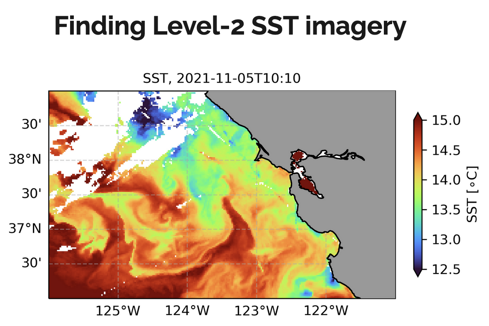
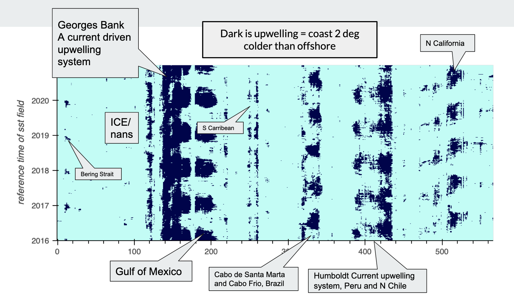
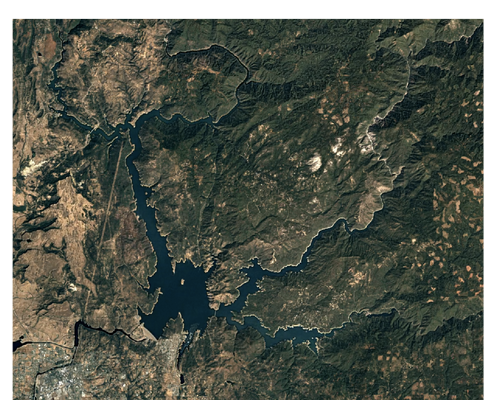
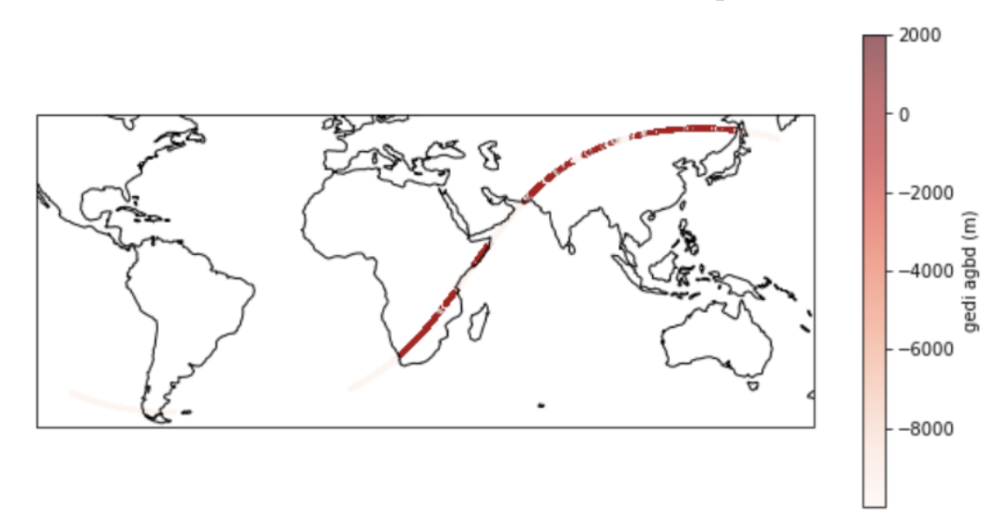
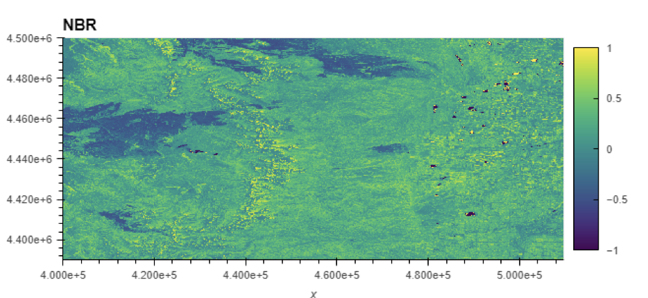
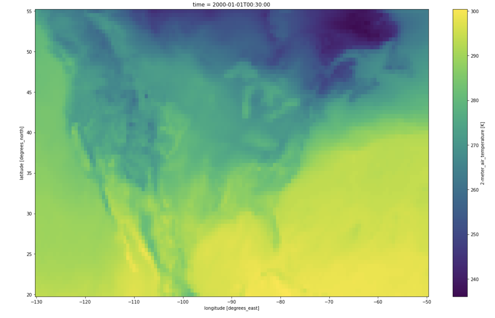
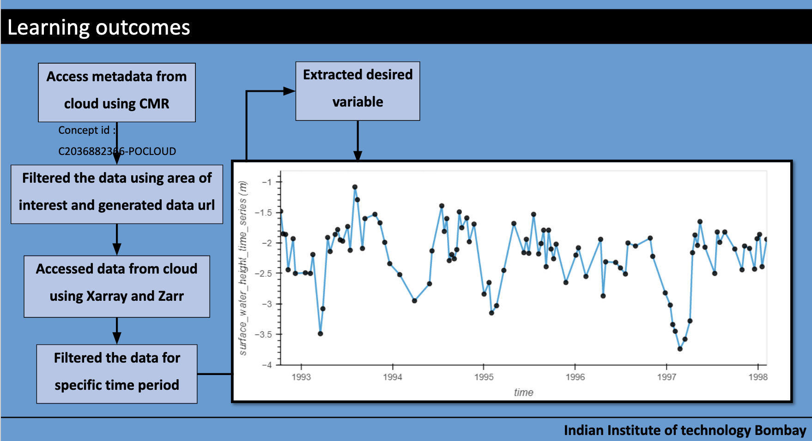

On the final day of the Hackathon, 9 awesome teams presented work-in-progress projects they had been hacking on, and we were so excited to see what they had already done and their ongoing momentum. Teams evolved throughout the Hackathon, some joined as a team and welcomed others, and other teams formed and merged throughout the week.

Hackathon participants will have 3 months of continued access to the 2i2c JupyterHub and Slack as they continue experimenting. This way we can all learn more about what the transition to the Cloud looks like (and costs) and support more researchers using NASA Earthdata on the Cloud. 

Below is brief information about each project team, with links and screenshots from slides and notebooks in GitHub repos that they shared on the final day of the Hackathon.

## Field Campaigns

<!---Proj 1+7--->

**Team:** Tom Farrar, Kyla Drushka, Bia Villas Boas., Matthew Archer, Kathleen Dohan, Severine Fournier, Eli Hunter, John Wilkin

**Primary Helpers:** Jinbo Wang, Jack McNelis, Ed Armstrong

[**Slides**](https://docs.google.com/presentation/d/1l2RxFG1tO-0piDvKUkdUQC0wHwp7lFhPSSbLCpESSW4/edit#slide=id.p); **GitHub:** <https://github.com/NASA-Openscapes/nch2021-projects-contexdata>

**Project Goals:** 
Extract and visualize multiple data sets that can be used to give context to field campaigns or other regional events (e.g., the "Warm Blob" or the recent atmospheric river event on the West Coast).  For example, choose a target region and time period, cycle through all available high-resolution sea surface temperature data, identify clear images, catalog them.  Extract wind, wave, sea surface height, salinity data. 

## Global Upwelling Patterns

<!---Proj 2--->

**Team:** Eli Holmes, Jorge Vazquez

**Primary Helpers:** Aaron Friesz, Andy Barrett, Jack McNelis

[**Slides**](https://docs.google.com/presentation/d/1YjBrNRHCPWUKjoT5FC3FgqhzcVuJsqtmrFdRW29FkGs/edit#slide=id.p), **GitHub:** <https://github.com/NASA-Openscapes/nhw21-projects-upwelling>, **Notebook**: <http://nbviewer.org/github/NASA-Openscapes/nhw21-projects-upwelling/blob/main/notebooks/05-Multi-year-upi-plots.ipynb>

**Project Goals:** 
Climate change is predicted to change coastal upwelling. This study explores the use of simple SST metrics for studying upwelling signatures.

Also: [Running the NASA Cloud Workshop notebooks with mybinder.org](https://github.com/eeholmes/jupyterhub) - by Eli Holmes, 2021 Cloud Hackathon Participant who then set up working in Binder

## Surface Body Water

<!---Proj 3+8--->

**Team:** Matthew Bonnema, Maximilian Parzen

[**Slides**](https://docs.google.com/presentation/d/1o_o8FLjzX86XWc-idKujpxDwHVtoF5sHfFxCCw3bgwA/edit#slide=id.p), **GitHub:** <https://github.com/pz-max/NASA_projectX>

**Project Goals:** 
Estimate surface area of surface water body and track changes over time. Test Case: Oroville Reservoir, California

## Pypsicle: cryo computing in the cloud

<!---Proj 4--->

**Team:** Chad Greene, Susan Howard, Luis Lopez, Cassandra Nickles, Christine Sadlik, Jessica Scheick

**Primary Helpers:** Luis Lopez

[**Slides**](https://docs.google.com/presentation/d/1umWIIJ49U1Lukk78EJI6q-tii3s91qJpSmHWPEkqCxg/edit?usp=sharing), **GitHub:** <https://github.com/NASA-Openscapes/nch2021-projects-pypsicle>, **Notebook: **  <https://nbviewer.org/github/NASA-Openscapes/nch2021-projects-pypsicle/blob/main/S3-h5_example_rendered.ipynb>

**Project Goals:** 
Selectively read in part of an hdf5 file, explore a dataset on the cloud

## Query stact for HLS data and load as a time series 

<!---Proj 5--->

**Team:** Todd Hawbaker, Jodi Riegle, and Kehan Yang

[**Slides**](https://github.com/tjhawbaker/nch21_hls_timeseries/blob/main/2021%20Cloud%20Hackathon%20-%20Final%20Project%20Presentation%20-%20hls_timeseries.pptx); **GitHub:** <https://github.com/tjhawbaker/nch21_hls_timeseries>

**Project Goals:** 
A cloud-deployable framework to identify burned areas in the harmonized Landsat Sentinel-2 data, and possibly other remotely sensed data sources. Basically, extending what we've done with Landsat to HLS data (Hawbaker et. al., 2020). The end product we are planning is code or a container that users could run in the cloud to generate a time series of burned area products for their area of interest.

## Drought Monitor

<!---Proj 6--->

**Team:** Colin Brust, Arthur Endsley

**Project Goals:** 
Build a data pipeline library that clips, reprojects and aggregates a given dataset to a desired spatial and temporal resolution. Then, use this library to feed GHRSST data into a neural network that forecasts changes in the U.S. Drought Monitor.

## County Temperatures

<!--- Proj 9 --->

**Team:** Binita KC, Xiaohua Pan

**Primary Helpers:** Alexis Hunzinger

**GitHub:** <https://github.com/NASA-Openscapes/nch21-projects-counties-temp>, **Notebook**: <https://github.com/NASA-Openscapes/nch21-projects-counties-temp/blob/main/Project9.ipynb> 

**Project Goals:** 
Read the hourly MERRA-2 data from the GES DISC S3 bucket, subset by temperature and calculate the monthly average, ideally extract zonal mean using county shapefile

## Retrieval of Pre SWOT data

<!--- Proj 10 --->

**Team:** Prof. J. Indu, Kaushlendra V., Nitish K., Manu K.S., Girish P. 

[**Slides**](https://docs.google.com/presentation/d/1Z9cmmMZ8Ow0a3PpdyRIyicppwxh5kpN-/edit?usp=sharing&ouid=117588048875901229534&rtpof=true&sd=true)

**Project Goals:** 
To access multi-mission altimetry data sets and merge them to generate high temporal resolution altimetry data

