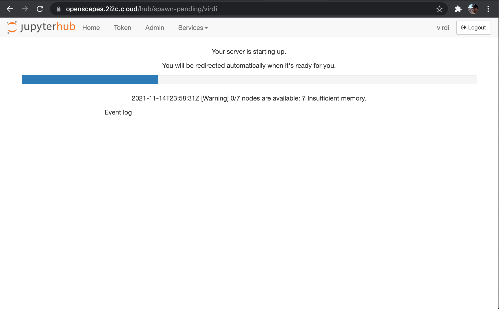
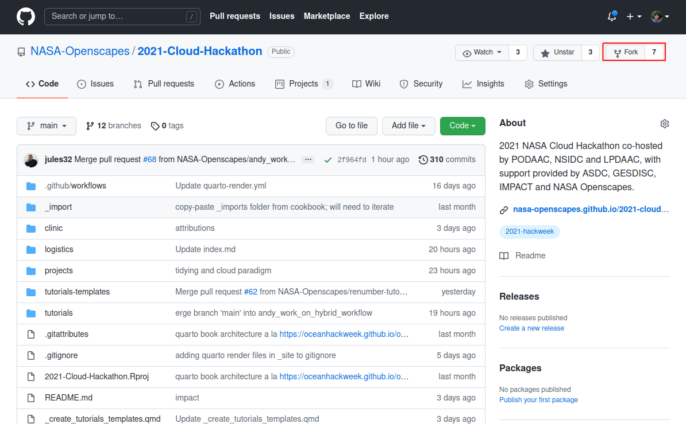
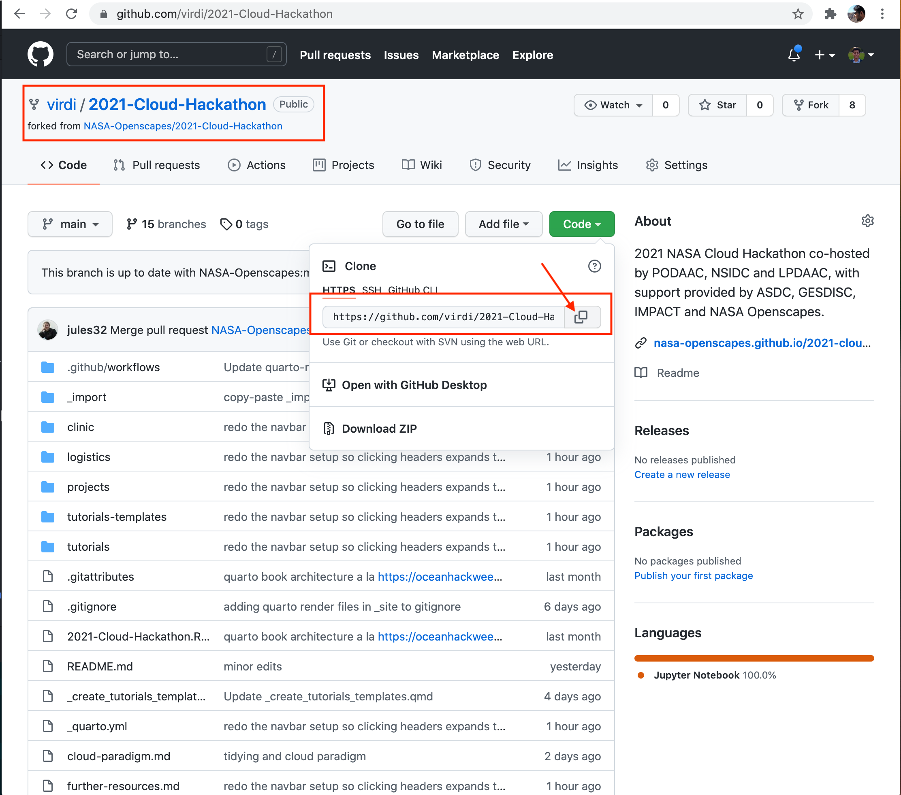

This tutorial will help you set up your JupyterHub (or Hub) with tutorials and other materials from our Cloud Hackathon github repository and connect your github account.

## Step 1. Login to the Hub

Please go to the Openscapes Jupyter Hub. Log in with your GitHub Account, and select "Small".

<!-- Alternatively, you can also click this badge to launch the Hub:

{fig-align="center"}

{width="500"}

{width="500"}

{width="500"}

{width="500"} --> 

> **Note:** It takes a few minutes for the Hub to load. Please be patient!

While the Hub loads, we'll:

-   Discuss cloud environments
-   See how my Desktop is setup
-   Fork the Hackathon repository at github.com
-   Discuss python and conda environments

Then, when the Hub is loaded, we'll get oriented in the Hub and clone the forked repository into our cloud environment.

## Discussion: Cloud environment

A brief overview about the [NASA Openscapes Cloud Environment](https://nasa-openscapes.github.io/2021-Cloud-Hackathon/clinic/jupyterhub.html) (following lessons from the Clinic).

#### Cloud infrastructure

-   Cloud: AWS [`us-west-2`](https://goo.gl/maps/BYqGYxahpwJgzKwR8)
    -   Data: AWS S3 (cloud) and [NASA DAAC](https://earthdata.nasa.gov/eosdis/daacs) data centers (on-prem).
    -   Cloud compute environment: [2i2c Jupyterhub deployment](https://docs.2i2c.org/en/latest/)
        -   IDE: [**JupyterLab**](https://jupyterlab.readthedocs.io/en/stable/getting_started/overview.html)

## Discussion: My desktop setup

I'll screenshare to show and/or talk through how I have oriented the following software we're using:

-   2i2c Jupyterhub  (our main workspace)
-   [Hackathon Repo](https://github.com/nasa-openscapes/2021-Cloud-Hackathon/) \<\> [Hackathon Book](https://nasa-openscapes.github.io/2021-Cloud-Hackathon/) (my teaching notes, your reference material)
-   Zoom Chat
-   Slack

## Step 2. Fork the Hackathon GitHub repository

"How do I get the tutorial repository into the Hub?". There are 2 steps. The first is from GitHub.com to fork the tutorial repository so that there is a connected copy in your user account that you can edit and push changes that won't affect the nasa-openscapes copy.

Go to <https://github.com/nasa-openscapes/2021-Cloud-Hackathon> and fork the repository.



**Note:** if you've already done this in the Pre-Hackathon Clinic, you'll need to make sure you have the latest, following the [daily setup](https://nasa-openscapes.github.io/2021-Cloud-Hackathon/logistics/github-workflows.html#daily-setup) instructions.

## Discussion: Python and Conda environments

[**Why Python?**](https://foundations.projectpythia.org/foundations/why-python.html)


**Default Python Environment:**

We've set up the Python environment with conda.

::: {.callout-note collapse="true"}
### Conda environment

``` yaml
name: openscapes
channels:
  - conda-forge
dependencies:
  - python=3.9
  - pangeo-notebook
  - awscli~=1.20
  - boto3~=1.19
  - gdal~=3.3
  - rioxarray~=0.8
  - xarray~=0.19
  - h5netcdf~=0.11
  - netcdf4~=1.5
  - h5py~=2.10
  - geoviews~=1.9
  - matplotlib-base~=3.4
  - hvplot~=0.7
  - pyproj~=3.2
  - bqplot~=0.12
  - geopandas~=0.10
  - zarr~=2.10
  - cartopy~=0.20
  - shapely==1.7.1
  - pyresample~=1.22
  - joblib~=1.1
  - pystac-client~=0.3
  - s3fs~=2021.7
  - ipyleaflet~=0.14
  - sidecar~=0.5
  - jupyterlab-geojson~=3.1
  - jupyterlab-git
  - jupyter-resource-usage
  - ipympl~=0.6
  - conda-lock~=0.12
  - pooch~=1.5
  - pip
  - pip:
    - tqdm
    - harmony-py
    - earthdata
    - zarr-eosdis-store
```
:::

### Bash terminal and installed software

Libraries that are available from the terminal

-   gdal 3.3 commands ( gdalinfo, gdaltransform...)
-   hdf5 commands ( h5dump, h5ls..)
-   netcdf4 commands (ncdump, ncinfo ...)
-   jq (parsing json files or streams from curl)
-   curl (fetch resources from the web)
-   awscli (AWS API client, to interact with AWS cloud services)
-   vim (editor)
-   tree ( directory tree)
-   more ...

### Updating the environment

Scientific Python is a vast space and we only included libraries that are needed in our tutorials. Our default environment can be updated to include any Python library that's available on pip or conda.

The project used to create our default environment is called **corn** (as it can include many Python kernels).

If we want to update a library or install a whole new environment we need to open an issue on this repository. We can help your teams do this during project hacktime.

### [corn 🌽](https://github.com/NASA-Openscapes/corn)

## Step 3. JupyterHub orientation

Now that the Hub is loaded, let's get oriented.

[{width="500"}](img/JupyterHub-View.png)

### First impressions

-   Launcher & the big blue button
-   "home directory"

## Step 4. Clone the Hackathon GitHub repository

Now we'll clone the GitHub repository, using a git extension for the JupyterHub. Go to your github account, and navigate to the repository that you just created by forking from the Openscapes repository.

Click to copy the url for cloning the repository.

{width="2224"}

Now, go to JupyterHub and click on the git extension in the left panel and then click the blue button "Clone a Repository".


Then, paste the repository link to the forked repository that you copied from your github account into the "Clone a repo" pop up window. Then click the blue "CLONE" button. It will take a few moments to clone the repository into your Hub.

Your link should look like `https://github.com/YOUR-USERNAME/2021-Cloud-Hackathon`. For example, the link is https://github.com/**virdi**/2021-Cloud-Hackathon. Note that it include your github username in the repo link.


Alternatively, you can use the terminal (command line) as per [github workflows: first-time setup](https://nasa-openscapes.github.io/2021-Cloud-Hackathon/logistics/github-workflows.html).

Once the repository is cloned, you will see a new directory in the "File Browser" panel on the left named "2021-Cloud-Hackathon". In this directory, you have all hackathon material including the tutorials and this book to follow along during other Tutorials. You are all set.


> **REMEMBER:** This is your copy (or fork) of the hackathon materials and jupyter notebooks. So feel free to make any changes to the content of this repository.

## Jupyter notebooks

Let's get oriented to Jupyter notebooks, which we'll use in all the tutorials.

## How do I end my session?

*(Also see [How do I end my Openscapes session? Will I lose all of my work?](https://nasa-openscapes.github.io/2021-Cloud-Hackathon/clinic/jupyterhub.html#how-do-i-end-my-openscapes-session))*

When you are finished working for the day it is important to explicitly log out of your Openscapes session. The reason for this is it will save us a bit of money! When you keep a session active it uses up AWS resources and keeps a series of virtual machines deployed.

Stopping the server happens automatically when you log out, so navigate to "File -> Log Out" and just click "Log Out"!

!!! NOTE "logging out" - Logging out will **NOT** cause any of your work to be lost or deleted. It simply shuts down some resources. It would be equivalent to turning off your desktop computer at the end of the day.

## Step 5. Tracking changes (Optional)

Now that you have forked and cloned the repository in your Hub, you can make changes (edit, add, and/or delete content) and track these files using git. In this step, we will provide an overview of how to use git using the graphical interface (the JupyterLab git extension).

### Step 5.1. Configure Git (`git config`)

Configure git with your name and email address as shown here.

``` bash
git config --global user.name "Makhan Virdi"
git config --global user.email "Makhan.Virdi@gmail.com"
```

Open a new terminal: `File >> New >> Terminal`


Configure `git` to store your github credentials to avoid having to enter your github username and token each time you push changes to your repository(in [Step 5.5](#step-5.5.-transmit-committed-changes-to-your-github-(git-push),%20we%20will%20describe%20how%20to%20use%20github%20token%20instead%20of%20a%20password), we will describe how to use github token instead of a password)

``` bash
git config --global credential.helper store
```

### Step 5.2. Create a new file

Let's create a new file: In the left panel on your Hub, click on the "directory" icon and then double click on "2021-Cloud-Hackathon" directory. Then, create a new file using the text editor in your 2i2c JupyterHub (`File >> New >> Text File`). Add some text to this file, for example: `A test file`. Save this file and rename it to `test.txt`.


### Step 5.3. Track the changes to the new file (`git add`)

Click the git icon in the left panel. You can see that the newly added file is in the "Untracked" section. You can click the `+` icon next to the file name to let `git` track this file for changes.


### Step 5.4. Commit the changes to the new file (`git commit`)

Now, you will see that the file is **Staged**, which means that `git` is ready to take a snapshot of this file (and the repository) with the changes that you made. This snapshot is called a `commit`. To commit the changes, add a note (called a *commit message*) by typing in the text box that say "Summary".

Now, click the blue "COMMIT" button to commit this change.

> Note: A short message indicating the type of change to this file is a good practice. Optionally, a longer description may be added to the "Description" field.


### Step 5.5. Transmit committed changes to your github (`git push`) {#step-5.5.-transmit-committed-changes-to-your-github-git-push}

At this stage, you have committed the changes to your git repository on your Hub. However, these changes are still on your Hub and needs to be transmitted to your repository on github (so that both the `local` copy on the JupyterHub and the `remote` copy on github are in sync).

As seen in the picture below, the git extension indicates (with an orange dot on the cloud icon) that it is ready to `push` your changes to the `remote` (remote = your repository on github.com). To push to github, click the cloud button with an up arrow (circled in red in the picture).


When you push for the first time, it will ask that you input your credentials. You will need to set this up with your Personal Access Token (PAT), explained next. 

### Step 5.6. Setup your Personal Access Token (PAT) {#step-5.6.-setup-pat}

When you see the following screenshot, GitHub is asking for you to input your credentials. (Note: you see this screenshot when you have committed work to push to GitHub.com, as detailed above).


The git extension in the Hub is prompting you to enter your github.com credentials. Enter you github.com username and a Personal Access Token (PAT);  **DO NOT** use your password. 

To create a PAT, visit **<https://github.com/settings/tokens/new>** and create a new token with the permission as per the image below and specify its validity for 90 days.


**IMPORTANT:** You will see this token only once, so be sure to copy this. If you do not copy your token at this stage, you will need to generate a new token.


Once you generate the token, copy it and paste in the Hub window that prompted you to enter the "Personal Access Token".


Git will show a message at the bottom right telling that the changes were "Successfully pushed". Also, you will see that the "cloud icon with an up arrow" no longer has an orange dot, indicating that there are no more committed changes to push to the remote (github.com).

> Note: You have configured git extension to store your credentials. You will not be prompted for your login/token again!


That's all. You can use the same workflow (`add > commit > push`) for any other new or modified files!

------------------------------------------------------------------------

> Note: If you are comfortable with the command line, you can use the Terminal (In Hub, New \> Terminal) and follow the steps outlined in [the Clinic section](https://nasa-openscapes.github.io/2021-Cloud-Hackathon/clinic/notebooks.html#introduction-version-control-git-and-github).
